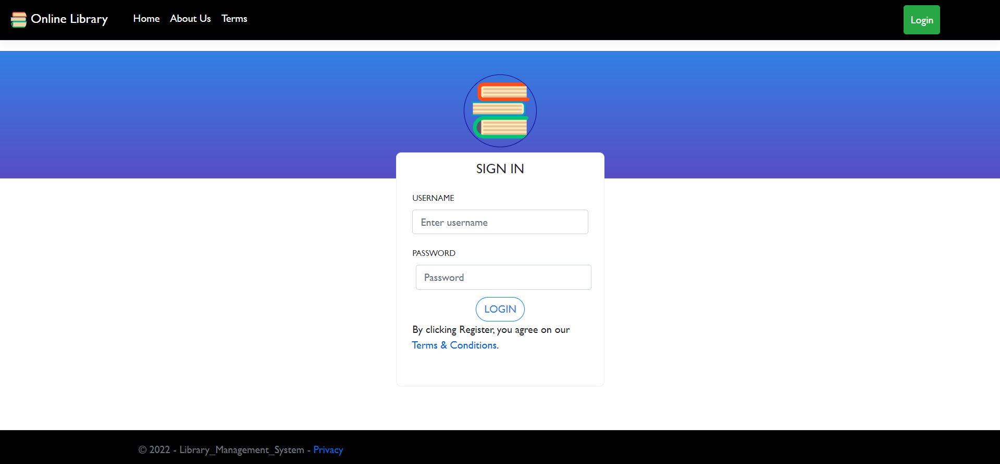
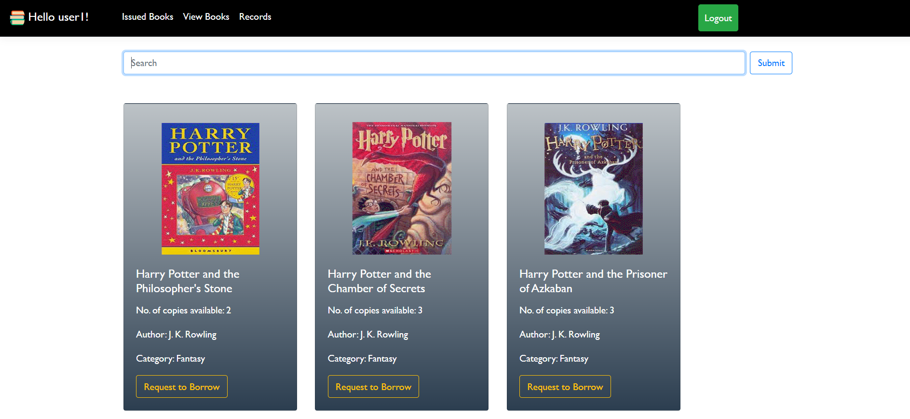

# Library Management System

An educational ASP.NET Core MVC web application for managing a library catalogue, accounts, lending requests, returns, and fines.

> This repository is a learning project, not a production-ready library system. Its authentication implementation is a prototype and must not be used with real user accounts or data.

## Features

- **Administrators:** manage books, authors, publishers, and accounts; approve or decline lending requests; track issued books and lending history.
- **Users:** browse the catalogue, request available books, view issued books, return books, and review lending history.

## Screenshots

| Landing page | Sign in | Book catalogue |
| --- | --- | --- |
|  |  |  |

## Technology

- .NET 5 and ASP.NET Core MVC
- Entity Framework Core 5 with SQL Server
- Razor views, Bootstrap, and jQuery

## Project Layout

```text
.
├── LibraryManagementSystem.sln
└── LibraryManagementSystem/
    ├── Controllers/  # MVC routes for catalogue, accounts, and lending
    ├── Models/       # Entity Framework models, context, and repositories
    ├── Migrations/   # Tracked Entity Framework migration history
    ├── Views/        # Razor pages and role-specific layouts
    └── wwwroot/      # Static images, styles, scripts, and front-end libraries
```

## Run Locally

### Prerequisites

- .NET 5 SDK
- SQL Server or SQL Server LocalDB

```bash
dotnet restore LibraryManagementSystem.sln
dotnet run --project LibraryManagementSystem/LibraryManagementSystem.csproj
```

The default connection string is in `LibraryManagementSystem/appsettings.json` and targets a local SQL Server database named `LMS_DB` using Windows integrated authentication. Update it for your local database; do not commit connection strings containing credentials.

### Database State

The repository contains one Entity Framework migration that alters an existing schema, not a complete initial migration or seed dataset. A fresh-database bootstrap is therefore not verified. Before running the application against a new database, create and validate an initial schema migration or restore a compatible database.

## Development Notes

- .NET 5 is end-of-support. Treat a framework and package upgrade as a separate, tested modernization task.
- The current login flow stores and compares plain-text passwords and includes a hard-coded administrator branch. Do not deploy it or use it with real credentials.
- No license has been selected. Do not assume permission to copy, modify, or redistribute the project.

## Contributing

See [CONTRIBUTING.md](CONTRIBUTING.md) for guidelines.
